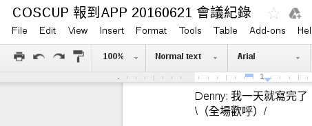
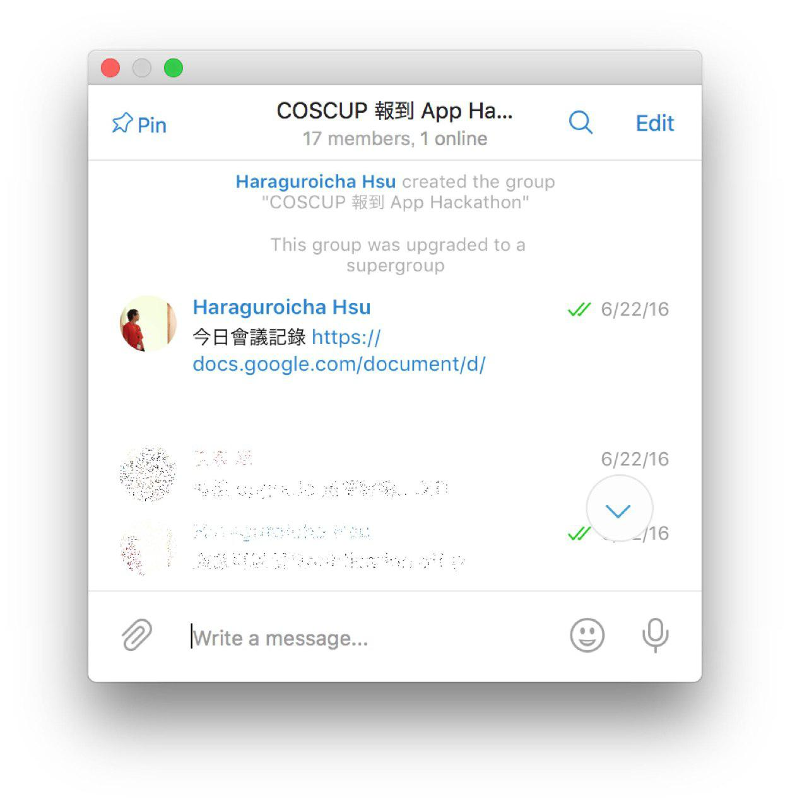
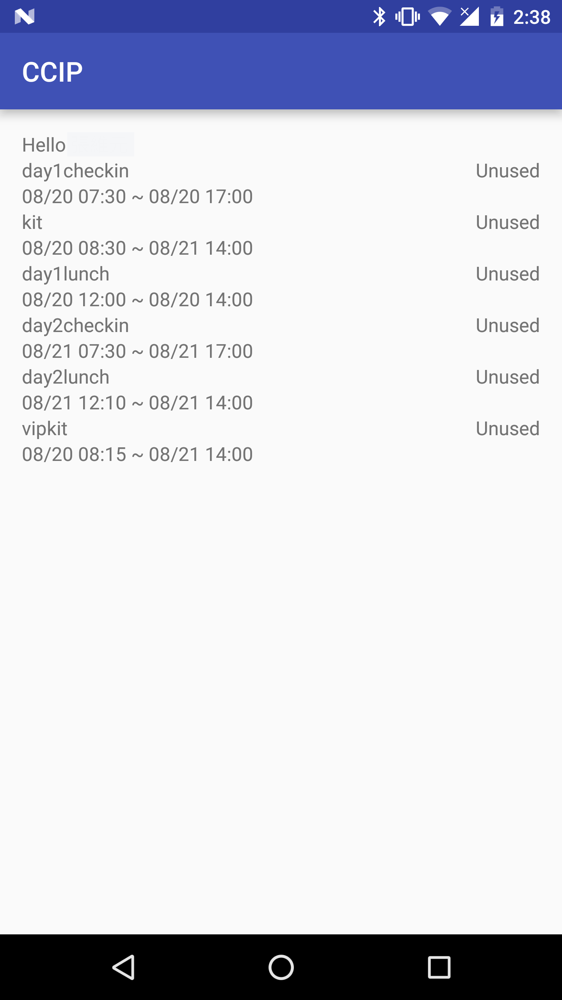
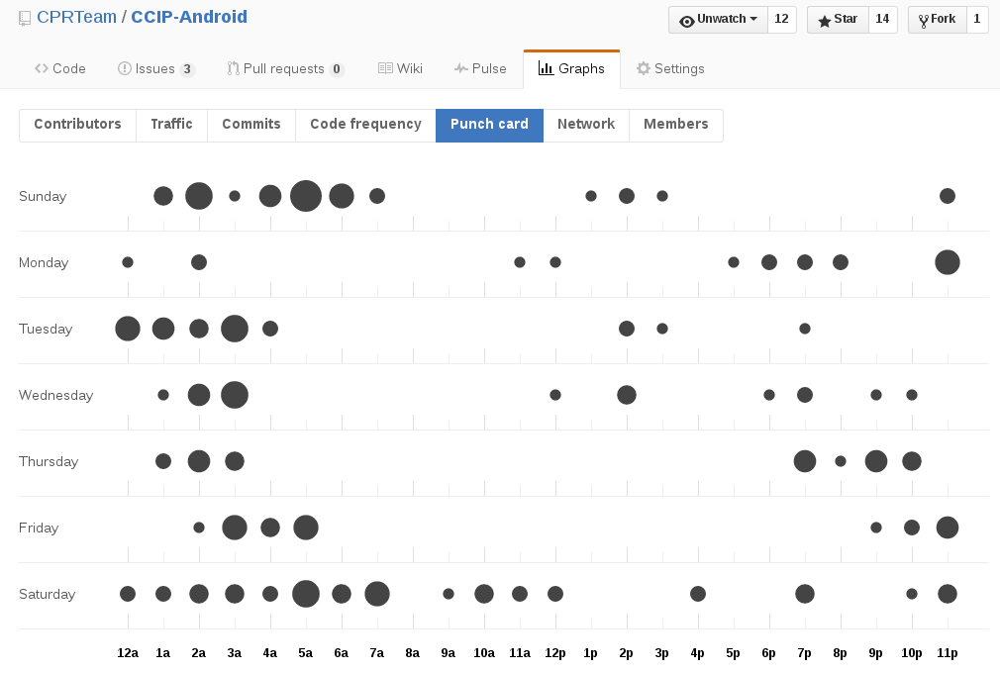
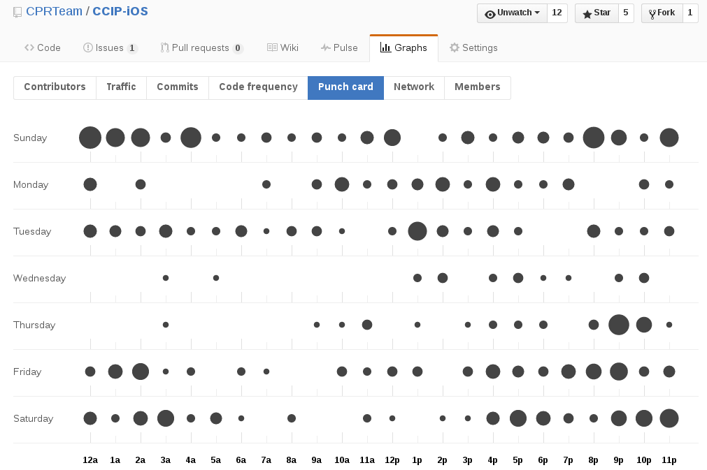
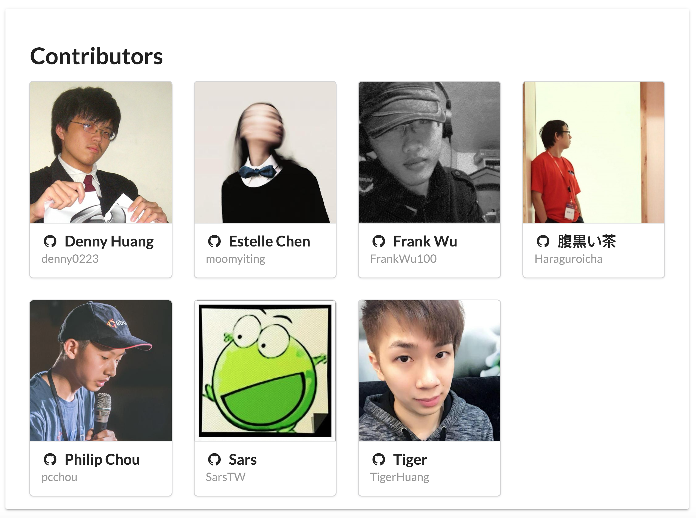

title: COSCUP Pass App 開發秘辛
output: index.html

--

<h1 style="font-size: 84px">
  COSCUP Pass 
  App 開發秘辛
</h1>
 

--

  

--

# ~= 46 人 / min
## 1700人 * 80% / 30min

--

# Feature

--

  

--

  

--

  

--

* [CCIP-Android](https://github.com/CPRTeam/CCIP-Android)

* [CCIP-iOS](https://github.com/CPRTeam/CCIP-iOS)

* [CCIP-Server](https://github.com/CPRTeam/CCIP-Server)

* [CCIP-Landing](https://github.com/CPRTeam/CCIP-Landing)

* CCIP-Administration

--

  

--

  

--

# demo

--

# 流量

--

# 1 TB

--

# 報到率

--

# 74%
## Day 1

--

# 55%
## Day 2

--

# 人工報到

--

# 31.4%
## Day 1

--

# 17.3%
## Day 2

--

  

--

# 致歉

--

<h1 style="font-size: 52px">
  https://github.com/CPRTeam/
</h1>

